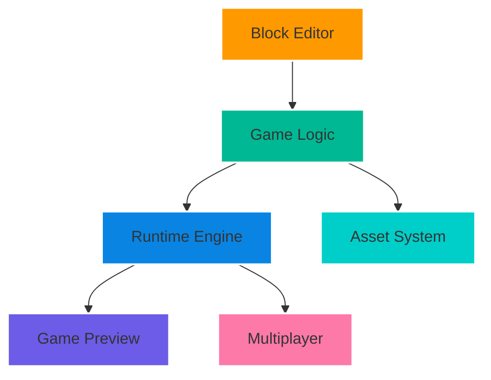
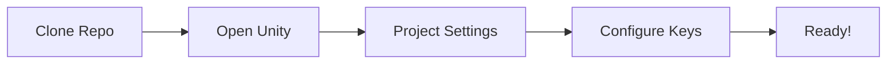
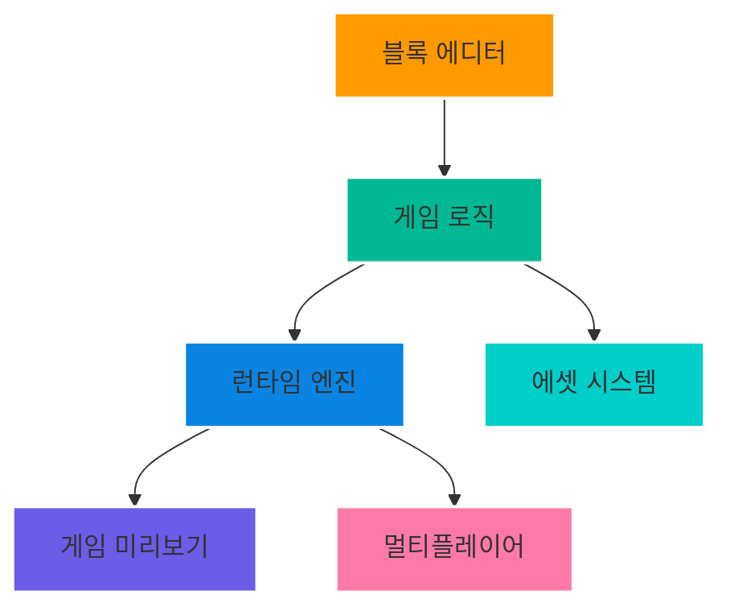
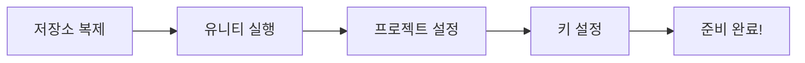

# 🎮 BlockFlow Engine

> [!NOTE]  
> This project is currently on a development hiatus.<br>
> 이 프로젝트는 현재 개발 임시 중단 입니다.
> 
> ```
> Development Progress | 개발 진행률
> 
> 🔨 Core Engine     [▱▱▱▱▱▱▱▱▱▱] 0%
> 🎨 Block Editor    [▰▱▱▱▱▱▱▱▱▱] 10%
> 🌐 Multiplayer     [▱▱▱▱▱▱▱▱▱▱] 0%
> 📚 Documentation   [▰▰▱▱▱▱▱▱▱▱] 20%
> ```

[한국어 버전은 아래에 있습니다 / Korean version below](#korean)

[](https://opensource.org/licenses/MIT)
_LTS-red.svg)


<div align="center">
  


  <p><strong>BlockFlow Engine</strong> - Unleash your creativity with visual programming in Unity</p>
</div>

## 🌟 Project Introduction

BlockFlow Engine is an innovative visual programming platform built on Unity, designed to transform game development into an accessible and enjoyable experience. Inspired by educational programming platforms, it empowers creators to build games through an intuitive block-based coding system.

### ✨ Core Features

- **Advanced Visual Programming System** 🎯
  ```mermaid
  flowchart LR
    A[Drag & Drop] --> B[Block Connection]
    B --> C[Live Preview]
    C --> D[Instant Feedback]
    style A fill:#ff9900
    style B fill:#00b894
    style C fill:#0984e3
    style D fill:#6c5ce7
  ```
  - Smart block snapping system with type checking
  - Real-time syntax validation
  - Custom function blocks creation
  - Variable system with visual debugging

- **Powerful Runtime Engine** ⚡
  - Custom event system architecture
  - Optimized execution engine
  - Hot-reload capability
  - Performance monitoring tools

- **Multiplayer Integration** 🌐
  - AWS Partner "BackEnd" server integration
  - Photon PUN2 networking system
  - Real-time game state synchronization
  - Built-in lobby system
  - Player Authentication and Friend Feature

- **Asset Management System** 🎨
  - Integrated sprite editor
  - Animation creation tools
  - Sound effect manager
  - Asset library system
  - Asset Import / Export functionality

- **Game Development Tools** 🛠️
  - Scene Management System
  - Physics Simulation Controls
  - Particle System Editor
  - UI Object Library
  - Debugging Tools

## 🚀 Getting Started

### Prerequisites

- Unity 6 (6000.0.28F1) LTS
- BackEnd SDK
- Photon PUN2

### Quick Start Guide

1. Clone the repository:
```bash
git clone https://github.com/Jeonhyeonmin/BlockFlow-Engine.git
```

2. Open in Unity Hub and configure:


## 🔧 Development Setup

### Backend Configuration
```json
{
  "backend": {
    "projectName": "BlockFlow",
    "serverRegion": "Asia",
    "authentication": {
      "method": "JWT",
      "timeout": 3600
    }
  }
}
```

### Photon Setup
```json
{
  "photon": {
    "networkProtocol": "UDP",
    "serverSettings": {
      "maxPlayers": 50,
      "timeout": 5000
    }
  }
}
```

## 📖 Documentation

Comprehensive documentation available in our [Wiki](https://github.com/Jeonhyeonmin/BlockFlow-Engine/wiki).

## 🤝 Contributing

We welcome contributions! Please see our [Contributing Guide](CONTRIBUTING.en.md).

## 📜 License

MIT License - see [LICENSE](LICENSE)

## 💌 Contact

Project Manager - [@Jeonhyeonmin](https://github.com/Jeonhyeonmin)

Project Link: [https://github.com/Jeonhyeonmin/BlockFlow-Engine](https://github.com/Jeonhyeonmin/BlockFlow-Engine)

---

<h1 id="korean">🎮 BlockFlow Engine (한국어)</h1>

<div align="center">
  


  <p><strong>BlockFlow Engine</strong> - 유니티 기반의 비주얼 프로그래밍으로 여러분의 창의성을 펼치세요</p>
</div>

## 📝 프로젝트 소개

BlockFlow Engine은 유니티 기반의 혁신적인 비주얼 프로그래밍 플랫폼입니다. 교육용 프로그래밍 플랫폼에서 영감을 받아, 직관적인 블록 기반 코딩 시스템을 통해 누구나 쉽게 게임을 만들 수 있도록 설계되었습니다.

### ✨ 핵심 기능

- **고급 비주얼 프로그래밍 시스템** 🎯
  ```mermaid
  flowchart LR
    A[드래그 앤 드롭] --> B[블록 연결]
    B --> C[실시간 미리보기]
    C --> D[즉각적인 피드백]
    style A fill:#ff9900
    style B fill:#00b894
    style C fill:#0984e3
    style D fill:#6c5ce7
  ```
  - 스마트 블록 스내핑 시스템
  - 실시간 문법 검증
  - 커스텀 함수 블록 생성
  - 시각적 디버깅이 가능한 변수 시스템

- **강력한 런타임 엔진** ⚡
  - 커스텀 이벤트 시스템
  - 최적화된 실행 엔진
  - 핫 리로드 지원
  - 성능 모니터링 도구

- **멀티플레이어 통합** 🌐
  - AWS 공식 파트너사 "뒤끝" 서버 연동
  - Photon PUN2 네트워킹
  - 실시간 게임 상태 동기화
  - 내장 로비 시스템
  - 플레이어 인증 및 친구 기능

- **에셋 관리 시스템** 🎨
  - 통합 스프라이트 에디터
  - 애니메이션 제작 도구
  - 사운드 이펙트 매니저
  - 에셋 라이브러리
  - 에셋 불러오기 / 내보내기 기능

- **게임 개발 도구** 🛠️
  - 씬 관리 시스템
  - 물리 조절 시뮬레이션
  - 파티클 시스템 에디터
  - UI 오브젝트 라이브러리
  - 디버깅 도구

## 🚀 시작하기

### 필수 요구사항

- Unity 6 (6000.0.28F1) LTS
- BackEnd SDK
- Photon PUN2

### 빠른 시작 가이드

1. 저장소 클론:
```bash
git clone https://github.com/Jeonhyeonmin/BlockFlow-Engine.git
```

2. Unity Hub에서 열고 설정:


## 🔧 개발 환경 설정

### 백엔드 설정
```json
{
  "backend": {
    "projectName": "BlockFlow",
    "serverRegion": "Asia",
    "authentication": {
      "method": "JWT",
      "timeout": 3600
    }
  }
}
```

### Photon 설정
```json
{
  "photon": {
    "networkProtocol": "UDP",
    "serverSettings": {
      "maxPlayers": 50,
      "timeout": 5000
    }
  }
}
```

## 📖 문서

자세한 문서는 [Wiki](https://github.com/Jeonhyeonmin/BlockFlow-Engine/wiki)를 참조하세요.

## 🤝 기여하기

기여를 환영합니다! [기여 가이드](CONTRIBUTING.ko.md)를 참조해 주세요.

## 📜 라이선스

MIT 라이선스 - [LICENSE](LICENSE) 참조

## 💌 연락처

프로젝트 관리자 - [@Jeonhyeonmin](https://github.com/Jeonhyeonmin)

프로젝트 링크: [https://github.com/Jeonhyeonmin/BlockFlow-Engine](https://github.com/Jeonhyeonmin/BlockFlow-Engine)
